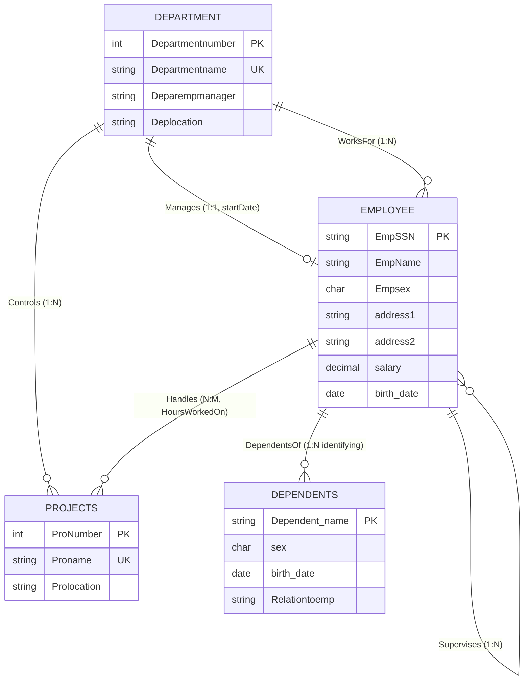

# Corporate Organization Database Design (Company DBMS)

This database design project models a corporate organization tracking employees, departments, projects, and dependents. It is based on the advanced ER layout in [company-diagram.png](company-diagram.png).

---

## Conceptual ER Diagram (Mermaid.js)

---

## Design Features

### 1. Recursive Supervisor Hierarchies
The Supervises recursive loop represents the management structure on the EMPLOYEE entity. One employee acts as supervisor (1) and another acts as supervisee (N).

### 2. Relationship Attributes
The Handles many-to-many relationship holds the attribute HoursWorkedOn. Because hours belong to the specific intersection of an employee and a project, they reside strictly on the relationship itself, mapping physically as a column in the WORKS_ON junction table.

### 3. Weak Entity Identification
DEPENDENTS is modeled as a weak entity depending on the owner EMPLOYEE via the identifying relationship DependentsOf.

---

## References

* [Advanced Corporate Schema (Draw.io)](company-diagram.png)
