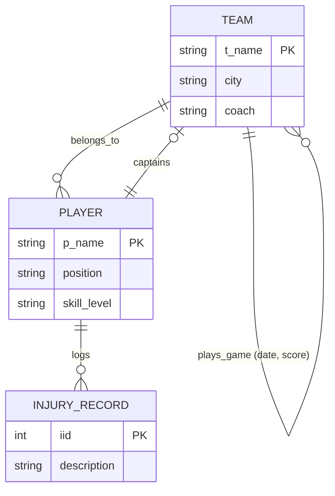

# National Hockey League (NHL) Database Design

This project models a sports league database tracking teams, players, captains, recursive games, and weak injury logs.

---

## Requirements Overview

Based on standard NHL administrative rules:
* The NHL consists of multiple teams.
* Each team has a name, city, coach, captain, and players.
* Each player belongs to exactly one team and has a name, position, skill level, and injury records.
* A team captain is a player.
* A game is played between two teams (host and guest) with a date and score.

---

## Conceptual ER Diagram (Mermaid.js)

---

## Design Highlights

* Weak Entity: INJURY_RECORD depends entirely on PLAYER for identity. It is linked via an identifying relationship.
* Recursive Relationship: A game is played between two TEAM instances (host and guest). Attributes date and score reside on the plays_game relationship itself.

---

## References

* [Original Slide Requirements](nhl-requirements.jpg)
* [Hand-drawn Diagram Answer](nhl-diagram.jpg)
