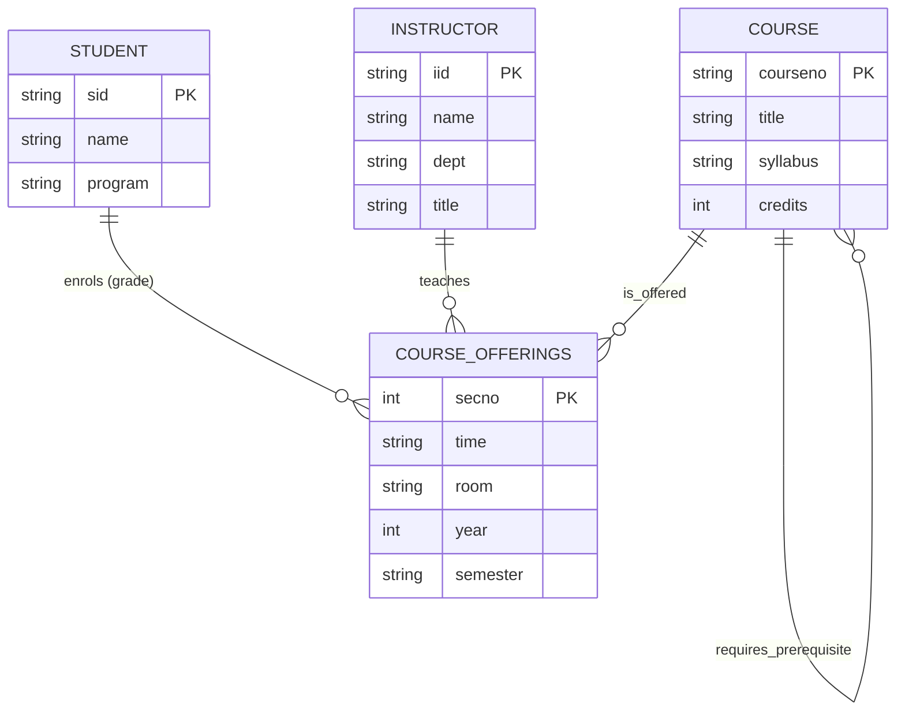

# University Registrar Database Design

This project contains two conceptual database designs for a University Registrar's Office:
1. Model A (Core registrar system): Models courses, course offerings (weak entity), instructors, and enrollments.
2. Model B (Expanded student system): Models student profiles, addresses, major/minor departments, and a ternary GradeReport.

---

## Model A: Core Registrar Design (Mermaid.js)

* Weak Entity: COURSE_OFFERINGS depends on COURSE via the identifying relationship "is_offered" (secno acts as discriminator).
* Recursive Relationship: COURSE contains a self-referencing relationship representing prerequisites.

---

## Model B: Expanded Registrar Design

Based on the advanced [advanced-registrar-diagram.jpg](advanced-registrar-diagram.jpg) structure:
* Separates student names into FirstName and LastName.
* Tracks composite addresses (City, State, Zip).
* Establishes a ternary GradeReport link connecting Student, Section, and the weak GradeReport entity.

---

## References

* [Original Slide Requirements](university-requirements.jpg)
* [Hand-drawn Diagram Answer](university-diagram.jpg)
* [Advanced Production Schema](advanced-registrar-diagram.jpg)
